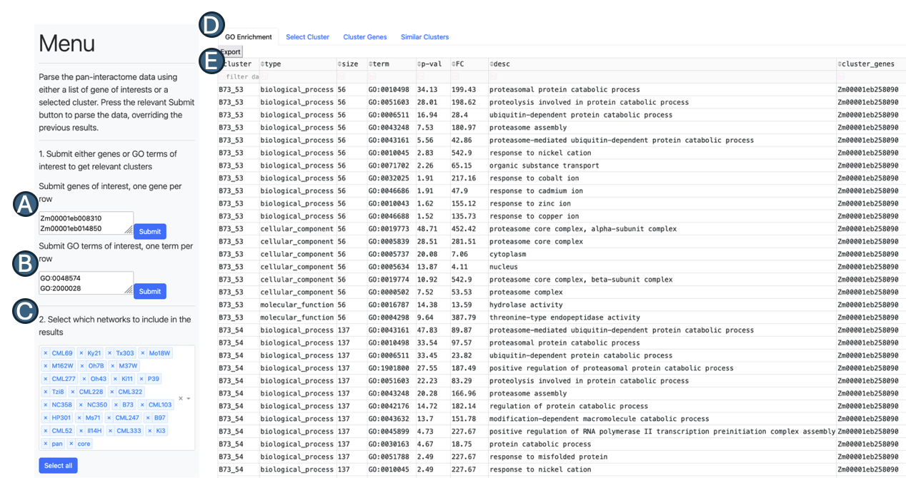
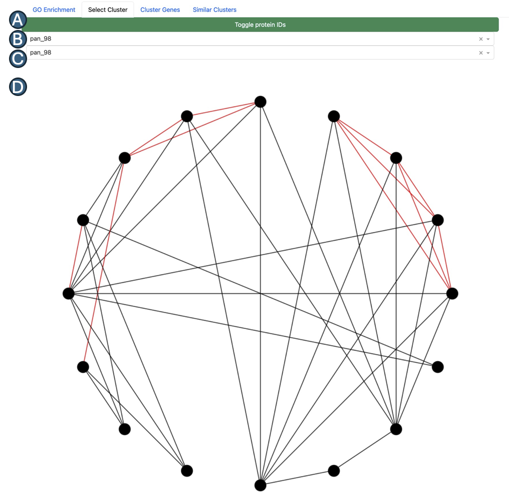
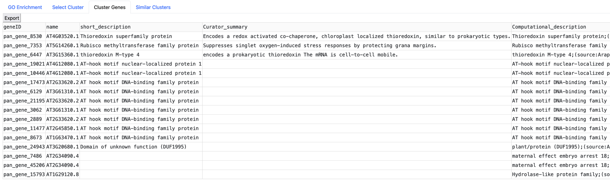
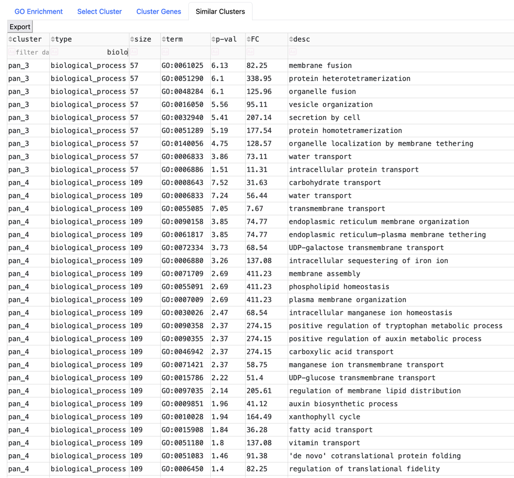

# Standlone Dash web-application for accessing the pan-PPI data

## Summary

To facilitate access to the generated data, we developed a standalone Python Dash web application (v2.13.0). The dash application takes one of two user inputs: (1) genes or (2) GO terms of interest. Based on the selected input, the web-application identifies all relevant genome-, core-, and pan-interactome clusters containing either the genes or the enriched GO terms of interest. The cluster similarity network is used to identify all overlapping based on a Jaccard similarity index score > 0.5. The interface provides four output tabs that are updated based on the cluster selected: (1) a table containing all the enriched GO terms for the relevant clusters identified based on the user input, (2) a network graph showing the predicted PPIs and co-expression data between cluster members, (3) a table of the gene description annotation for cluster members based on protein sequence similarity to A. thaliana genes, and (4) a table containing all the enriched GO terms for similar clusters. The standalone web application and detailed installation instructions are available online at https://github.com/eporetsky/PanPPI/.

## Main Window and Query Submission 

In the left-hand menu tab, submit either a list of genes or GO terms of interest to identify relevant clusters with enriched GO terms.

* `(A)` - Either submit a list of genes of interest, one gene per row
* `(B)` - Or submit a list of GO terms of interest, one term per row
* `(C)` - Select which genotypes to include in the results
* `(D)` - Use the panels to get information about specific clusters
* `(E)` - A table containing all clusters containing either genes or GO terms of interst 

## Gene Cluster Selection and Network Graph Tab

In the second "Select Cluster" tab you can select the cluster from the table of clusters in the "GO Enrichment" tab. Selecting a cluster from the (A) drop-drown menu, will update the output in the (B) similar cluster drop-down menu, "Cluster Genes" tab gene description annotation table, and "Similar Clusters" tab containing all clusters within the same group as the selected cluster, based on a Jaccard similairty index score < 0.5.

* `(A)` - A button that updates the graph to add gene IDs to the nodes
* `(B)` - Select cluster based on the clusters available in the first tab
* `(C)` - Select similar clusters basedon the selected cluster above
* `(D)` - A network graph of the selected cluster (black edges for PPIs, red edges for co-expression, and blue edges for both)

## Gene Cluster Selection and Network Graph Tab

The content of this tab contian the gene descriptions, based on the DIAMOND best hits to the Arabidopsis genes and their descriptions. The table is updated based on the selected cluster from the drop-down menu of either the selected genes or the selcted similar clusters.

## Similar CLuster Tab

The content of this tab contian the similar cluster to the selected clusters. The similar clusters are the clusters that are found in the same connected component group, based on a Jaccard similairty index score < 0.5.

## Contact

For any technical issues or requests, please don't hesitate to contact me via a message, email or open an issue on GitHub. 
