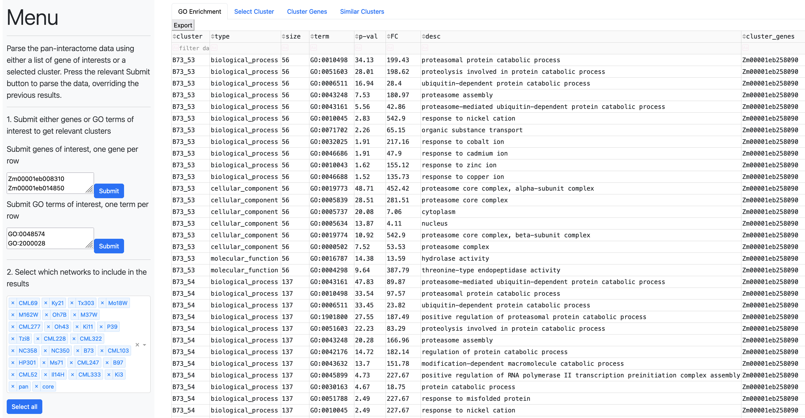

# Maize NAM Pan-PPI Analysis Framework

## Introduction

We present a framework for using the established STRING database to predict PPI networks as the basis for a pan-interactome analyses. This work extends a previous co-expression pan-transcriptome analysis conducted on the 26 maize nested association mapping (NAM) population inbreds [(Cagirici et al., 2022)](https://link.springer.com/article/10.1186/s12870-022-03985-z). A total of 26 predicted maize inbred genome-interactomes were predicted and used to generate a pan- and core-interactome. A PPI clustering algorithm was then used to identify groups of highly interconnected proteins that can be more easily used for downstream analyses and improve the overall interpretability of the predicted clustered interactomes. Furthermore, by integrating additional supporting information, such as gene co-expression, gene function annotation, and gene descriptions, we were able to significantly enhance cluster annotation. Thus, we show that the clustered interactomes can be used predict and correct putative protein function annotations while lists of candidate genes for given agronomically important traits can be probed to prioritize putative causal genes.

Links to the data used in the anlaysis:

* Protein sequences and canonical geneIDs from [MaizeGDB](https://download.maizegdb.org/)
* Pan-gene annotation from [MaizeGDB](https://download.maizegdb.org/Pan-genes/MaizeGDB_maize_pangene_2020_08.tsv.gz)
* Predicted GO annotations from [MaizeGDB](https://download.maizegdb.org/GeneFunction_and_Expression/Pannzer_GO_Terms/)
* Maize NAM transcriptomic data from [CyVerse](https://datacommons.cyverse.org/browse/iplant/home/maizegdb/maizegdb/MaizeGDB_qTeller_FPKM/NAM_qTeller_FPKM/NAM_Consortium_2021_qTeller_FPKM_unaveraged)
* Arabidopsis gene description from [arabidopsis.org](https://www.arabidopsis.org/download_files/Public_Data_Releases/TAIR_Data_20220331/Araport11_functional_descriptions_20220331.txt.gz)

Note: All files can currently be downloaded through this [link](https://www.dropbox.com/s/36782l72h53ldbn/PanPPI.zip?dl=0). Last updated: 10/19/23

Links to the predicted STRING-db accessions:

| Genome | Accession | Link |
| ------------- | ------------- | ------------- |
| B73 | STRG0A74HWH | https://version-12-0.string-db.org/organism/STRG0A74HWH |
| B97 | STRG0A27GYI | https://version-12-0.string-db.org/organism/STRG0A27GYI |
| CML52 | STRG0A83AFL | https://version-12-0.string-db.org/organism/STRG0A83AFL |
| CML69 | STRG0A36GMD | https://version-12-0.string-db.org/organism/STRG0A36GMD |
| CML103 | STRG0A96KOX | https://version-12-0.string-db.org/organism/STRG0A96KOX |
| CML228 | STRG0A73YIE | https://version-12-0.string-db.org/organism/STRG0A73YIE |
| CML247 | STRG0A00JYO | https://version-12-0.string-db.org/organism/STRG0A00JYO |
| CML277 | STRG0A56QVK | https://version-12-0.string-db.org/organism/STRG0A56QVK |
| CML322 | STRG0A28WKD | https://version-12-0.string-db.org/organism/STRG0A28WKD |
| CML333 | STRG0A55TNN | https://version-12-0.string-db.org/organism/STRG0A55TNN |
| HP301 | STRG0A09LBE | https://version-12-0.string-db.org/organism/STRG0A09LBE |
| Il14H | STRG0A95ZXD | https://version-12-0.string-db.org/organism/STRG0A95ZXD |
| Ki3 | STRG0A59ZFU | https://version-12-0.string-db.org/organism/STRG0A59ZFU |
| Ki11 | STRG0A04UPN | https://version-12-0.string-db.org/organism/STRG0A04UPN |
| Ky21 | STRG0A45QYR | https://version-12-0.string-db.org/organism/STRG0A45QYR |
| M37W | STRG0A63OIV | https://version-12-0.string-db.org/organism/STRG0A63OIV |
| M162W | STRG0A52TOM | https://version-12-0.string-db.org/organism/STRG0A52TOM |
| Mo18W | STRG0A55RTP | https://version-12-0.string-db.org/organism/STRG0A55RTP |
| Ms71 | STRG0A23ZQS | https://version-12-0.string-db.org/organism/STRG0A23ZQS |
| NC350 | STRG0A14RQS | https://version-12-0.string-db.org/organism/STRG0A14RQS |
| NC358 | STRG0A40HCS | https://version-12-0.string-db.org/organism/STRG0A40HCS |
| Oh7B | STRG0A12IXD | https://version-12-0.string-db.org/organism/STRG0A12IXD |
| Oh43 | STRG0A85TWD | https://version-12-0.string-db.org/organism/STRG0A85TWD |
| P39 | STRG0A89DFG | https://version-12-0.string-db.org/organism/STRG0A89DFG |
| Tx303 | STRG0A12FNF | https://version-12-0.string-db.org/organism/STRG0A12FNF |
| Tzi8 | STRG0A46PIG | https://version-12-0.string-db.org/organism/STRG0A46PIG |

Note: Manually change the name of the STRING files so they start with a "genotype_ID." prefix. The code assumed that there are no dots in the genotype ID so it would require changing dots to a different character.

# Conda environment

Creating conda environment
```
conda create --name ppi
conda activate panppi
conda install -c anaconda jupyter 
pip install pandas numpy seaborn networkx upsetplot matplotlib goatools
```

# Running the analysis workflow

```
python code_workflow.py
```

# Running the analysis workflow

We developed a [standalone web-application](https://github.com/eporetsky/PanPPI/tree/main/Dash) using the Python Dash package. Additional details are available within the the linked folder. Briefly, to get the package to run, move the content of the zipped analysis results file into the `Dash/` directory and nevigate in your terminal window to the folder using the following commands: 

```
conda activate panppi
cd Dash
python app.py
```

Once the Dash PanPPI webapplication is running, access it on your browser through the follwoing link: [http://127.0.0.1:8000/](http://127.0.0.1:8000/).



# Citations

The manuscript by Poretsky <i>et al.</i> is currently under review.

If you are using this workflow please also considering citing:
* [MaizeGDB](https://download.maizegdb.org/) for providing the canonical protein sequences
* [STRING-db](https://string-db.org/) for generating the predicted PPI networks
* [ClusterONE](https://paccanarolab.org/cluster-one/) for clustering the predicted PPI networks
* [PyWGCNA](https://github.com/mortazavilab/PyWGCNA/blob/main/PyWGCNA/comparison.py) for comparing cluster overlap
* [GO Consortium](https://www.geneontology.org/) for the GO annotation
* [PANZER2](http://ekhidna2.biocenter.helsinki.fi/sanspanz/) that was used for generating the GO annotations for the genomes
